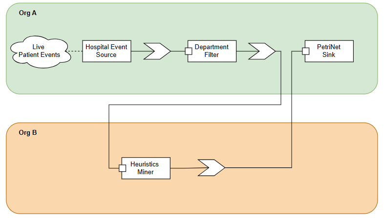

# ⚙️ DAPM – Scenario Processing Elements

This repository contains the **Processing Elements (PEs)** and scripts used to
set up the hospital–research scenario for the DAPM end-to-end streaming
platform.



---

## 🧠 What’s here?

- Java files implementing the PEs (source / operators / sinks)
- Configuration Schemas JSON files used to validate the PEs
- A Node.js script to upload/register the PEs in the target organizations

---

## 🚀 How to use

1. **Clone the repo**

   ```bash
   git clone https://github.com/DAPM-Thesis-25/processing-elements-templates.git
   cd processing-elements-templates
